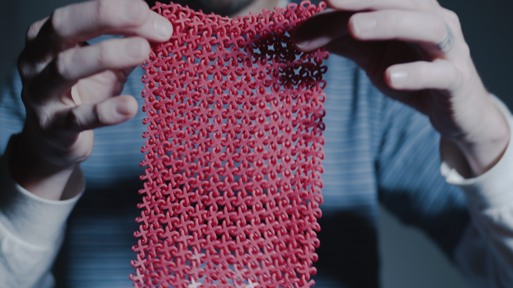
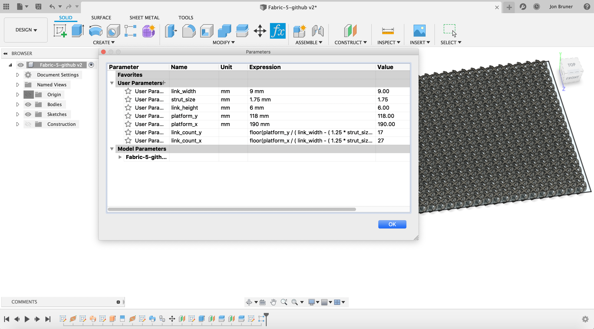

# chainmail

Chainmail is an example of a functional assembly—a group of separate parts that can be made fully assembled on a 3D printer like [Carbon’s M2](https://www.carbon3d.com/), which uses ultraviolet light and oxygen to continuously cure a liquid polymer resin into a solid part.

[We shared a video of these fabrics](https://www.instagram.com/p/B8hfffLJcF0/) that features two materials: the [rigid UMA 90](https://www.carbon3d.com/materials/uma-urethanemethacrylate/), a single-part resin available in CMYK colors that can be blended right before printing, and the [elastomeric EPU 41](https://www.carbon3d.com/materials/epu-elastomeric-polyurethane/), the same dual-cure material that adidas uses in its [4D midsoles](https://www.adidas.com/us/4D).

Each link has four loops that can hook adjacent links. The height and width of the links and the thickness of the struts influence the way the chainmail behaves and feels in the hand.

Included here are STL files of two chainmail designs for easy printing, as well as the original CAD file that you can modify to get the effect you want.
* [fabric-1.stl](fabric-1.stl) has links 9mm wide and 6mm high, and struts 1.75mm in diameter (on a reduced build platform in order to fit on GitHub)
* [fabric-2.stl](fabric-2.stl) has links 12mm wide and 9mm high, and struts 2mm in diameter
* [fabric.f3d](fabric.f3d) is the original parametric CAD file, presented here so you can reconfigure link width, link height, strut diameter, and build platform size. Once you’ve opened the file in [Autodesk Fusion 360](https://www.autodesk.com/products/fusion-360/overview), you can open the parameters table to adjust the link design.

